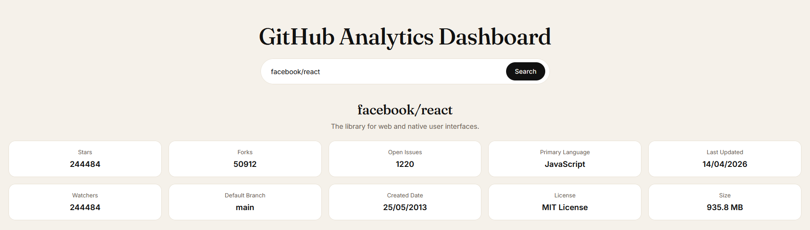
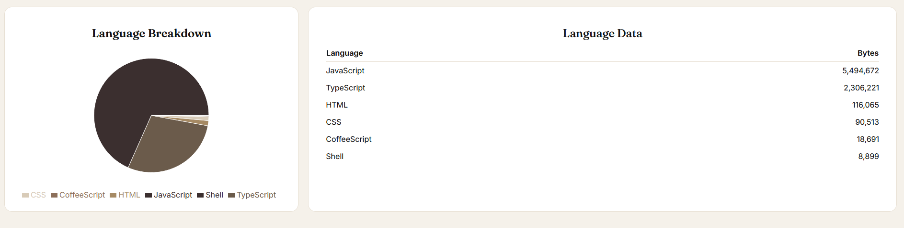
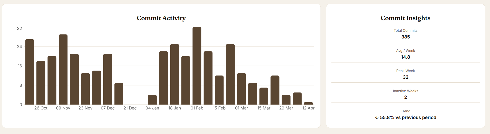

# GitHub Analytics Dashboard

A React-based analytics dashboard for exploring public GitHub repositories.

This project goes beyond basic repository data by visualising trends, activity, and insights to better understand how a project evolves over time.

---

## Features

### Repository Overview

* Key metrics:

  * Stars
  * Forks
  * Open Issues
  * Watchers
  * Primary Language
  * Last Updated
  * License, Size, and more

### Language Analysis

* Interactive language breakdown (chart)
* Detailed language data table

### Commit Activity

* Weekly commit activity (bar chart)
* Selectable time ranges:

  * 12 weeks
  * 26 weeks
  * 52 weeks

### Commit Insights

* Total commits (selected range)
* Average commits per week
* Peak activity week
* Inactive weeks
* Trend vs previous period

---

## Tech Stack

* React (Vite)
* JavaScript
* Recharts (data visualisation)
* GitHub REST API

---

## Motivation

This project was built to move beyond simple API consumption and focus on:

* Transforming raw data into meaningful insights
* Designing clean, user-focused interfaces
* Handling real-world edge cases (e.g. incomplete API data, trend calculations)

---

## Screenshots

### Repository Overview

### Language Breakdown

### Commit Activity

---

## Future Improvements

* Contributors analytics
* Issues / pull request insights
* Improved data filtering and comparisons
* UI refinements and responsiveness

---

## Author

Ethan J McNab
