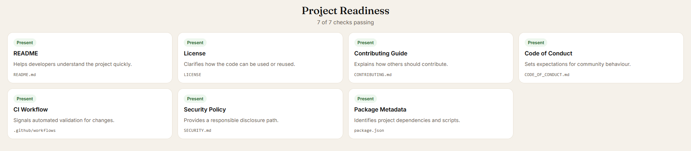
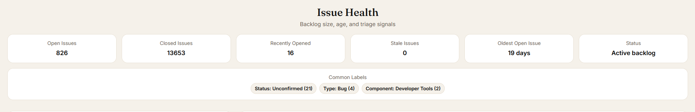
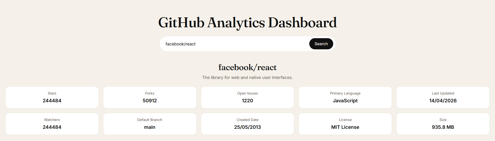
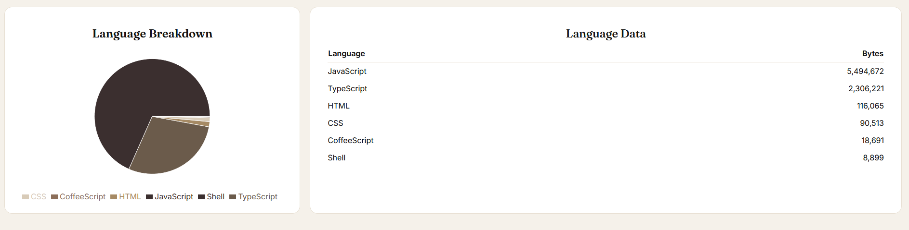
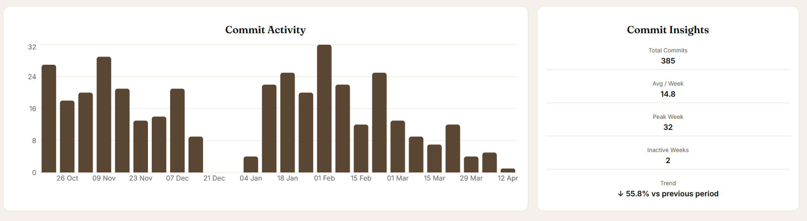
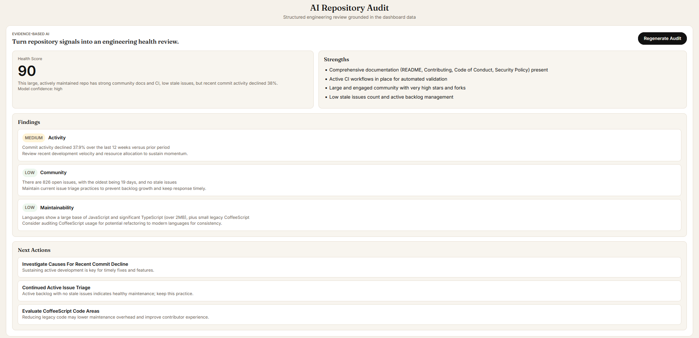

# GitHub Analytics Dashboard

A React dashboard for exploring public GitHub repositories through engineering health signals, repository activity, and an AI-assisted audit layer.

The project turns GitHub REST API responses into a structured analytics snapshot, then uses a server-side AI boundary to generate evidence-based repository audit findings. It is designed as a practical portfolio project: the AI feature is grounded in deterministic data, uses structured output, and keeps API keys out of browser code.

## Features

- Search any public GitHub repository by `owner/repo`.
- View repository metrics including stars, forks, open issues, watchers, language, license, size, and update dates.
- Inspect language usage with a chart and data table.
- Review weekly commit activity across 12, 26, or 52 week ranges.
- See commit insights including total commits, average commits per week, peak activity, inactive weeks, and trend versus the previous period.
- Review project readiness checks for README, license, contribution docs, code of conduct, CI, security policy, and package metadata.
- Inspect issue health signals such as backlog size, stale issues, oldest open issue, recent issue volume, and common labels.
- Generate an AI repository audit with a health score, strengths, severity-tagged findings, evidence, and recommended next actions.
- Route GitHub and OpenAI calls through server-side boundaries so tokens are not exposed in the browser.

## AI Architecture

The AI audit is intentionally not a chatbot. The app first collects deterministic repository data, then builds a compact analytics snapshot from:

- repository metadata
- language breakdown
- readiness checks
- issue health
- commit insights

The browser posts that snapshot to `/api/audit`. The server-side audit endpoint calls OpenAI's Responses API with a JSON schema so the response can be reliably rendered as structured UI.

This design demonstrates:

- grounded AI inputs instead of unstructured prompt dumping
- server-side API key handling
- schema-constrained AI output
- evidence-based recommendations tied to visible dashboard signals
- provider/model isolation behind a single audit service

## Tech Stack

- React
- Vite
- JavaScript
- Recharts
- GitHub REST API
- OpenAI Responses API
- GitHub Actions
- Dependabot

## Getting Started

### Prerequisites

- Node.js 20.19+ or 22.12+
- npm

### Installation

```bash
git clone https://github.com/EthanJMcNab/github-analytics-dashboard.git
cd github-analytics-dashboard
npm install
npm run dev
```

### Environment Variables

Create `.env.local` for local development:

```bash
GITHUB_TOKEN=github_pat_your_token_here
OPENAI_API_KEY=sk_your_openai_key_here
OPENAI_MODEL=gpt-4.1-mini
```

`GITHUB_TOKEN` is optional but recommended for local testing because unauthenticated GitHub API requests have low rate limits.

`OPENAI_API_KEY` is required for AI repository audits.

Do not prefix these values with `VITE_`. Vite exposes `VITE_` variables to browser code, and these keys must remain server-side.

## Server-Side API Boundaries

### GitHub Proxy

The client calls `/api/github/...` instead of calling `https://api.github.com` directly.

- Local development: Vite proxies `/api/github` to GitHub and attaches `GITHUB_TOKEN` server-side.
- Deployment: `api/github/[...path].js` handles the same proxy behaviour.

### AI Audit Endpoint

The client calls `/api/audit` with the structured repository analytics snapshot.

- Local development: Vite serves `/api/audit` through local middleware.
- Deployment: `api/audit.js` handles the same route.
- The OpenAI key stays server-side in environment variables.

## Deployment

This project includes Vercel-style API routes under `api/`.

For deployment, configure these environment variables in the hosting provider:

```bash
GITHUB_TOKEN=github_pat_your_token_here
OPENAI_API_KEY=sk_your_openai_key_here
OPENAI_MODEL=gpt-4.1-mini
```

Then deploy the app using the provider's standard Vite build settings.

## Useful Scripts

```bash
npm run dev
npm run lint
npm run build
npm run preview
```

## Quality and Repository Readiness

The repository includes:

- GitHub Actions CI for install, lint, and production build checks
- Dependabot updates for npm dependencies and GitHub Actions
- MIT license
- contribution guidelines
- code of conduct
- security policy

## Current Limitations

- The AI audit reviews repository health signals, not full source-code quality.
- GitHub API data can be rate-limited or delayed, especially commit activity stats.
- Private repository support would require authenticated GitHub access and additional permission handling.
- The audit quality depends on the snapshot data currently collected by the dashboard.

## Screenshots

### Search State


### Project Readiness



### Issue Health



### Repository Overview



### Language Breakdown



### Commit Activity



### AI Repository Audit



## Author

Ethan J McNab
